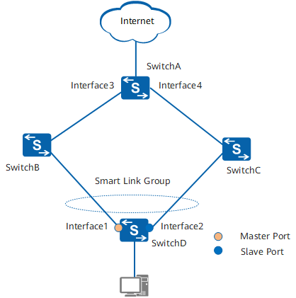
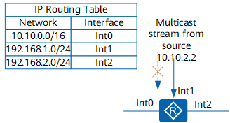
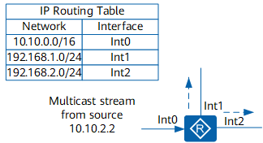

## HCIE笔试 ##

## IPv6报文格式 ##

IPv6报文由IPv6基本报头、IPv6扩展报头以及上层协议数据单元三部分组成。

上层协议数据单元一般由上层协议报头和它的有效载荷构成，有效载荷可以是一个ICMPv6报文、一个TCP报文或一个UDP报文。

### IPv6基本报头 ###

IPv6基本报头有8个字段，固定大小为40字节，每一个IPv6数据报都必须包含报头。基本报头提供报文转发的基本信息，会被转发路径上面的所有设备解析。

IPv6报文格式中主要字段解释如下：

- Version：版本号，长度为4bit。对于IPv6，该值为6
- Traffic Class：流类别，长度为8bit。等同于IPv4中的TOS（Type Of Service）字段，表示IPv6数据报的类或优先级，主要应用于QoS。
- Flow Label：流标签，长度为20bit。IPv6中的新增字段，用于区分实时流量，不同的流量标签+源地址可以唯一确定一条数据流，中间网络设备可以根据这些信息更加高效率的区分数据流。
- Payload Length：有效载荷长度，长度为16bit。有效荷载是指紧跟IPv6报头的数据报的其他部分（即扩展报头和上层的协议数据单元）。该字段只能表示最大长度为65535字节的有效载荷。如果有效荷载的长度超过这个值，该字段会置0，而有效荷载的长度用逐跳选项扩展报头中的超大有效载荷选项来表示。
- Next Header：下一个报头，长度为8bit。该字段定义紧跟在IPv6报头后面的第一个扩展报头（如果存在）的类型，或者上层协议数据单元中的协议类型。
- Hop Limit：跳数限制，长度为8bit。该字段类似于IPv4中的Time to Live字段，它定义了数据报所能经过的最大跳数。没经过一个设备，该数值减去1，当该字段的值为0时，数据报将被丢弃。
- Source Address：源地址，长度为128bit。表示发送方的地址。
- Destination Address：目的地址，长度为128bit。表示接收方的地址。

IPv6和IPv4相比，去除了IHL（Internet Header Length 报头长度）、identifiers（标识）、Flags（标志）、Fragment Offset（片位移）、Header CheckSum（头部校验和）、Options（选项部分）、Padding域（IPv4报头文是32bit的整数倍，在Option后面填充使用），只增加了流标签域，因为IPv6报文头的处理较IPv4大大简化，提高了处理效率。另外，IPv6为了更好支持各种选项处理，提出了扩展头的概念，新增选项时不必修改现有结构就能做到，理论上可以无线扩展，体现了优异的灵活性。

### IPv6扩展报头 ###

在IPv4中，IPv4报头包含可选字段OPtions，内容涉及security、Timestamp、Record route等，这些Options可以将IPv4报头长度从20字节扩充到60字节。在转发过程中，处理携带这些Options的IPv4报文会占用设备很大的资源，因此实际中也很少使用。

IPv6将这些Options从IPv6基本报头中剥离，放到了扩展报头中，扩展报头被置于IPv6报头和上层协议数据单元之间。一个IPv6报文可以包含0个、1个或多个扩展报头，仅当需要设备或目的节点做某些特殊处理时，才由发送方添加一个或多个扩展报头。与IPv4不用，IPv6扩展头长度任意，不受40字节现直，这样便于日后扩充新增选项，这一特性加上选项的处理方式使得IPv6选项能得以真正的利用。但是为了提高处理选项头和传输层协议的性能，扩展报头总是8字节长度的整数倍。

当使用多个扩展报头时，前面包头的Next Header字段指明下一个扩展包头的类型，这样就形成了链状的报头列表。IPv6基本报头中的Next Header字段指明了第一个扩展报头的类型，而第一个扩展报头中的Next Header字段指明了下一个扩展报头的类型（如果不存在，则指明上层协议的类型）。

IPv6扩展报头中主要字段解释如下：

- Next Header：下一个报头，长度为8bit。与基本包头的Next Header的作用相同。指明下一个扩展报头（如果存在）或上层协议类型。
- Extension Header Len：报头扩展长度，长度为8bit。表示扩展报头的长度（不包含Next Header字段）。
- Extension Head Data：扩展报头数据，长度可变。扩展报头的内容，为一系列选项字段和填充字段的组合。

目前，RFC中定义了6个IPv6扩展头：逐跳选项报头、目的选项报头、路由报头、分段报头、认证报头、封装安全净载报头。
<table>
<thead>
<tr>
  <th>报头类型</th>
  <th>代表该类报头的Next Header字段值</th>
  <th>描述</th>
</tr>
</thead>
<tbody>
<tr>
  <td>逐跳选项报头</td>
  <td>0</td>
  <td>该选项主要用于为在传送路径上的每跳转发指定发送参数，传送路径上的每台中间节点都要读取并处理该字段。逐跳选项报头目前的主要应用有以下三种： ·用于巨型载荷（载荷长度超过65535字节）。 ·用于设备提示，使设备检查该选项的信息，而不是简单的转发出去。 ·用于资源预留（RSVP）</td>
</tr>
<tr>
  <td>目的选项报头</td>
  <td>60</td>
  <td>目的选项报头携带了一些只对目的节点才会处理的信息。目前，目的选项报头主要应用于移动IPv6。</td>
</tr>
<tr>
  <td>路由报头</td>
  <td>43</td>
  <td>路由报头和IPv4的Loose Source and Record Route选项类似，该报头能够被IPv6源节点用来强制数据报经过特定的设备。</td>
</tr>
<tr>
  <td>分段报头</td>
  <td>44</td>
  <td>同IPv4一样，IPv6报文发送也收到MTU的限制。当报文长度超过MTU时就需要将报文分段发送，而在IPv6中，分段发送使用的是分段报头。</td>
</tr>
<tr>
  <td>认证报头</td>
  <td>51</td>
  <td>该报头由IPSec使用，提供认证、数据完整性以及重放保护。它还对IPv6基本报头中的一些字段进行保护。</td>
</tr>
<tr>
  <td>封装安全净载报头</td>
  <td>50</td>
  <td>该报头由IPSec使用，提供认证、数据完整性以及重放保护和IPv6数据报的保密，类似于认证报头。</td>
</tr>
</tbody>
</table>

**IPv6扩展报头规约**

当超过一种扩展报头被用在同一个分组里时，报头必须按照下列顺序出现：

- IPv6基本报头
- 逐跳选项报头
- 目的选项报头
- 路由扩展报头
- 分段扩展报头
- 认证扩展报头
- 封装安全有效载荷扩展报头
- 目的选项扩展报头
- 上层协议数据报文

路由设备转发时根据基本报头中Next Header值来决定是否要处理扩展头，并不是所有的扩展报头都需要被转发路由设备查看和处理的。

除了目的选项扩展报头可能出现一次或两次（一次在路由扩展报头之前，另一次在上层协议数据报文之前），其余扩展报头只能出现一次。

## 大二层网络 ##

为了实现业务的灵活变更，虚拟机动态迁移已经成为了一个常态性的业务。虚拟机动态迁移是指在保证虚拟机正常运行的同时，将虚拟机从一个物理服务器移动到另一个物理服务器的过程，该过程对于最终用户来说是无感知的，使得管理员在不影响用户正常使用的的情况下灵活调配服务器资源或者对物理服务器进行维修和升级。虚拟机动态迁移的关键是要保证在迁移时，虚拟机上的业务不会中断，这就要求虚拟机的IP地址、MAC地址等参数保持不变，所以虚拟机的迁移只能在一个二层域内进行，而不能扩二层域迁移。

传统网络中的虚拟机迁移

传统数据中心网络架构中二层网络部分为了提高可靠性，采用冗余设备和冗余链路，在虚拟机迁移过程中会不可避免地产生物理环路。

为了避免物理环路过程中产生的网络风暴，需要采用STP等破坏协议进行破坏，阻塞冗余链路。

由于STP性能的限制，采用STP协议进行破坏的二层网络通常不超过50个网路节点，导致虚拟机动态迁移只能在一个较小的局部范围内进行，应用受到极大限制。

为了实现虚拟机的大范围甚至跨地域的动态迁移，就要求将虚拟机动态迁移可能涉及的服务器都纳入同一个二层网络，形成一个更大范围的二层网络，这样才能实现虚拟机的大范围无障碍的迁移，这种二层网络称为大二层网络。

常见的大二层网络技术有：

- 网络设备虚拟化技术（NVGRE[Network Virtualization using Generic Routing Encapsulation]）。
- TRILL技术。
- VXLAN技术（Virtual eXtensible Local Area Network）。
- EVN技术。

然而，通过网络设备虚拟化技术、TRILL、EVN技术构建物理上的大二层网络，可以将虚拟机迁移的范围扩大。但是，构建物理上的大二层，难免需要对原来的网络做较大的改动，并且大二层网络的范围依然会受到种种条件的限制，然而VXLAN技术能够很好的解决上述问题。

在大二层网络中虚拟机动态歉意可以实现大范围无障碍的迁移。

大二层网络中的虚拟机迁移

### 网络虚拟化技术 ###

NVGRE和XLAN

[两种Overlay技术：NVGRE和XVLAN](https://zhuanlan.zhihu.com/p/144455307)

## ISIS ##

## OSPF ##

### OSPF NSSA ###

**定义**

OSPF规定STUB取余是不能引入外部路由的，这样可以避免大量外部路由对STUB区域路由器带宽和存储资源的消耗。对于既需要引入外部路由又要避免外部路由带来的资源消耗的场景，STUB区域就不再满足需求了。因此产生了NSSA取余。

OSPF NSSA区域（Not-So-Stubby Area）是OSPF新增的一类特殊的区域类型。

NSSA取余和STUB取余有许多相似的地方。两者的差别在于，NSSA区域能够将自治区域外部路由引入并传播到整个OSPF自治域中，同时又不会学习来自OSPF网络其他区域的外部路由。

**N-bit**

一个区域内所有路由器上配置的区域类型必须保持一致。OSPF在Hello报文中使用N-bit来标识路由器支持的区域类型，区域类型选择不一致的路由器不能建立OSPF邻居关系。

虽然协议有要求，但有些厂商实现时违背了，在OSPF DD报文中也置位了N-bit，为了和这些厂商互通，路由器的实现方式是可以通过命令设置N-bit来兼容。

**Type7 LSA**

- Type7 LSA是为了支持NSSA区域而新增的一种LSA类型，用于描述引入的外部路由信息。
- Type7 LSA由NSSA区域的自治域边界路由器（ASBR）产生，其扩散范围仅限于ASBR所在的NSSA区域。
- NSSA区域的区域边界路由器（ABR）受到Type7 LSA时，会有选择地将其转化为Type5 LSA，以便将外部路由信息通告到OSPF网络的其他区域。

**Type7 LSA转化为Type5 LSA**

为了将NSSA区域引入的外部路由发布到其他区域，需要把Type7 LSA转化为Type5 LSA以便在整个OSPF网络中通告。

- P-bit（Propagate bit）用于告知转化路由器该条Type7 LSA是否需要转化。
- 缺省情况下，转换路由器的是NSSA区域中Router ID最大的区域边界路由器（ABR）。
- 只有P-bit置位并且FA（Forwarding Address）不为0的Type7 LSA才能转化为Type5 LSA。FA用来表示发送某个目的地址的报文将被转发到FA所指定的地址。
- 区域边界路由器产生的Type7 LSA缺省路由不会置位P-bit。

**缺省路由环路预防**

在NSSA区域中，可能同时存在多个ABR，为了防止环路产生，边界路由器直接不计算对方发布的缺省路由。

## VXLAN ##

## TRILL ##

## NVGRE ##

## IGMP ##

## ISATAP ##

## Dual Stack ##

## SNMP ##

### SNMP简介 ###
介绍SNMP的定义、目的、版本演进以及受益

**定义**

简单网络管理协议SNMP（Simple Network Management Protocol）是广泛应用于TCP/IP网络的网络管理标准协议。SNMP提供了一种通过运行网络管理软件的中心计算机（即网络管理工作站）来管理设备的方法。

SNMP的特点如下：

- 简单：SNMP采用轮询机制，提供最基本的功能集，适合小型、快速、低价格的环境使用，而且SNMP以UDP报文为承载，因而受到绝大多数设备的支持。
- 强大：SNMP的目标是保证管理信息在任意两点传送，以便于管理员在网络上的任何节点检索信息，进行故障排查。

**目的**

随着网络技术的额飞速发展，在网络不断普及的同时也给网络管理带来了一些问题：

- 网络设备数量成几何级数增长，使得网络管理员对设备的管理变得越来越困难；同时，网络作为一个复杂的分布式系统，其覆盖地域不断扩大，也似的对这些设备进行实时监控和故障排查变得极为困难。
- 网络设备种类多种多样，不同设备厂商提供的管理接口（如命令接口）各不相同，这使得网络管理变得愈发复杂。

在这种背景下，SNMP应运而生。通过“利用网络管理网络”的方式，SNMP实现了对网络设备的高效和批量的管理；同时，SNMP协议也屏蔽了不同产品之间的差异，实现了不同种类和厂商的网络设备之间的统一管理。

### 配置SNMPv3的基本功能 ###

**注意事项**

在配置安全级别时，要确保告警主机的安全级别高于用户的安全级别， 且用户的安全级别高于用户组的安全级别。

安全级别按照安全性从高到低为：

- privacy：鉴权且加密
- authentication：只鉴权
- Node：不鉴权不加密

即如果用户组是privacy级别，用户和告警主机就必须是privacy级别；用户组是authentication级别，用户和告警主机可以使privacy或者authentication级别。

## 可靠性（高可用HA） ##

### Smart Link ###

**Smart Link基本概念**

Smart Link通过两个端口互相配合工作来实现功能。这样的一对端口组成了一个Smart Link组。为了区别一个Smart Link组中的两个端口，我们将其中的一个叫做主端口，另一个叫做从端口。同时我们利用Flush报文、Smart Link实例和控制VLAN等机制，以更好地实现Smart Link的功能（包括负载分担）。

图1 Smart Link示意图

- Smart Link组

	Smart Link组，一个组内最多可包含两个接口，其中一个为主接口，另一个为从接口。正常情况下，只有一个接口处于转发（Active）状态，另一个接口被阻塞，处于待命（Inactive）状态。

	如[图1](http://localhost:7890/pages/AZI02127/04/AZI02127/04/resources/dc/images/fig_dc_fd_smlk_000301.png)所示，设备SwitchD上的接口Interface1和接口Interface2组成了一个Smart Link组。

- 主接口/从接口

	如[图1](http://localhost:7890/pages/AZI02127/04/AZI02127/04/resources/dc/images/fig_dc_fd_smlk_000301.png)所示，Interface1被配置为Smart Link组的主接口，Interface2被配置为Smart Link组的从接口。主接口又叫Master接口，从接口又叫Slave接口。

	当Smart Link组中的两个接口都处于UP状态时，主接口将优先进入转发状态，从而接口将保持待命状态。当主接口所在链路发生故障时，从接口将切换为转发状态。

- Flush报文

	当Smart Link组发生链路切换时，原有的转发表项将不适用于新的拓扑网络，需要整网进行MAC表项和ARP表项的更新。这时，Smart Link组通过发送Flush报文通知其他设备进行MAC和ARP表项的刷新操作。如[图1](http://localhost:7890/pages/AZI02127/04/AZI02127/04/resources/dc/images/fig_dc_fd_smlk_000301.png)所示，当链路发生切换时，SwitchD会发送组播Flush报文通知SwitchA、SwitchB和SwitchC进行MAC和ARP表项的更新。

- 控制VLAN（Control VLAN）

	- 发送控制VLAN

		发送控制VLAN是Smart Link组用于广播Flush报文的VLAN。如[图1](http://localhost:7890/pages/AZI02127/04/AZI02127/04/resources/dc/images/fig_dc_fd_smlk_000301.png)，如果在SwitchD上开启了Flush报文发送功能，当发生链路切换时，设备会在发送控制VLAN内广播发送FLush报文。

	- 接收控制VLAN

		接收控制VLAN是上游设备用于接收并处理Flush报文的VLAN。如[图1](http://localhost:7890/pages/AZI02127/04/AZI02127/04/resources/dc/images/fig_dc_fd_smlk_000301.png)所示，如果上游设备SwitchA、SwitchB和SwitchC能够识别Flush报文，并开启了Flush报文接收处理功能，当发生链路切换时，上游设备会处理收到的属于接收控制VLAN的Flush报文，进而刷新MAC表和ARP表。

- 负载分担

	Smart Link支持配置多个负载分担VLAN实例。当Smart Link的主从链路均正常时，Smart link允许两条链路可以转发不同的数据流量。负载分担情况下，两个接口均处于转发状态，从接口转发负载分担实例流量，主接口转发其他实例流量。当其中一条链路故障时，Smart Link组会自动将所有的流量切换到另一条链路上。

- Smart Link实例

	Smart Link组的备链路通过绑定不同的实例来实现负载分担。Smart Link引用MSTP的实例，每个实例用来绑定若干VLAN，不同的实例绑定不同的VLAN。

## 组播路由管理 ##

### RPF检查 ###

**基本原理**

在单播路由与转发中，单播报文沿着一条单点到单点的路径传输，路由器只需要考虑报文“需要到达的位置”，即目的地址，就知道从哪个接口转发出去。组播路由与转发则不同。由于组播报文的目的地址为组播地址，只是标识了一组接受者，无法通过目的地址来找到接收者的位置，但是组播报文的“来源位置”，即源地址是确定的。所以组播报文的转发主要是根据其源地址来保证转发路径正确性。

路由器收到一份组播报文后，会根据报文的源地址通过单播路由表查找到达“报文源”的路由，查看到“报文源”的路由表项的出接口是否与收到组播报文的入接口一致。如果一致，则认为该组播报文从正确的接口到达，从而保证了整个转发路径的正确性和唯一性。这个过程就被成为RPF检查。

这里“正确的接口”通常被成为RPF接口，即RPF检查通过的接口。

##RPF检查过程##

除单播路由外，MBGP路由、组播静态路由也是RPF检查的依据。当路由器收到一份组播报文后，如果这三种路由表都存在，具体检查过程如下：

1、首先，通过报文源地址，分别从单播路由表、MGBP路由表和组播静态路由表中各选出一条最优路由。单播路由、MBGP路由的出接口为RPF接口，下一跳为RPF邻居。需要注意的是，组播静态路由实际上属于手工配置的组播路由，已经明确制定了RPF接口与RPF邻居。

2、然后，根据以下原则从这三条最优路由中选择一条作为RPF路由。

- 如果配置了按照最长匹配选择路由，则从这三条路由中选出最长匹配的那条路由；如果这三条路由的掩码一样，则选择优先级最高的那条路由；如果他们的优先级也相同，则按照组播静态路由、MBGP路由、单播路由的顺序进行选择。
- 如果没有配置按照最长匹配选择路由，则从这三条路由中选出优先级最高的那条路由；如果他们的优先级相同，则按照组播静态路由、MBGP路由、单播路由的顺序进行选择。

3、最后，路由器会将报文的入接口与RPF路由的RPF接口进行比较。如果一致则RPF检查通过，表明该报文来源路径正确，会将其向下游转发；如果不一致即RPF检查失败，表明该报文来源路径错误，就将其丢弃。

如[图1](http://localhost:7890/pages/DZG1127X/14/DZG1127X/14/resources/dc/images/fig_dc_fd_mrm_ipv4_000501.png)所示，来自组播源10.10.2.2的组播流从Int1口到达路由器，路由器检查路由表，发现可以转发该组播流的端口为Int0，RPF检查失败。因此达到Int1口的数据流被丢弃。

图1 RPF检查失败示例

[图2](http://localhost:7890/pages/DZG1127X/14/DZG1127X/14/resources/dc/images/fig_dc_fd_mrm_ipv4_000502.png)中，来自组播源10.10.2.2的组播流从Int0口达到路由器，检查路由表发现入接口与接收组播流的接口Int0一致，RPF检查成功。因此组播流将被正确的转发。

图2 RPF检查成功示例

**RPF检查在组播数据转发中的应用**

组播路由协议通过已有的单播路由、MBGP路由或组播静态路由信息来确定上、下游邻居设备，创建组播路由表项。运用RPF检查机制，来确保组播数据流能够沿组播分发树（路径）正确的传输，同时可以避免转发路径上环路的产生。

在实际组播数据转发过程中，如果对每一份接收到的组播数据报文都通过单播路由表进行RPF检查，会给路由器带来很大负担。因此，路由器在收到一份来自源S发往组G的组播数据报文之后，首先会在组播转发表中查有无相应的（S，G）组播转发表项：

- 如果不存在（S,G）转发表项，则对该报文执行RPF检查，将检查到的RPF接口作为入接口，创建组播路由表项，下发到组播转发表中。其中，对RPF检查结果的处理方式为：如果检查通过，表明接收接口为RPF接口，向转发表项的所有出接口转发；如果检查失败，表明报文来源路径错误，丢弃该报文。
- 如果存在（S,G）转发表项，并且接收该报文的接口与转发表项的入接口一致，则向所有的出接口转发该报文。
- 如果存在（S,G）转发表项，但是接收该报文的接口与转发表项的入接口不一致，则对此报文进行RPF检查。对RPF检查结果的处理方式为：
	- 若RPF检查选取出的RPF接口与转发表项的入接口一致，则说明（S,G）表项正确，报文来源路径错误，将其丢弃。
	- 若RPF检查选取出的RPF接口与转发表项的入接口不符，则说明（S，G）表项已过时，于是把表项中的入接口更新为RPF接口。然后再根据RPF检查规则进行判断：如果接收该报文的接口正是其RPF接口，则向转发表项的所有出接口转发该报文，否则将其丢弃。

## IPv6 ##

介绍IPv6的定义、由来和作用

**定义**

IPv6(Internete Protocol Version 6)是网络层协议的第二代标准，也被称为IPng(IP Next Generation)。它是Internet工程任务组IETF(Internet Engineering Task Force)设计的一套规范，是IPv4(Internet Protocol Version 4)的升级版本。

**目的**

IPv4协议是目前广泛部署的因特网协议。在因特网发展初期，IPv4以其协议简单、易于实现、互操作性好的优势而得到快速发展。但随着因特网的迅猛发展，IPv4设计的不足也日益明显，IPv6的出现，解决了IPv4的一些弊端。相比于IPv4，IPv6具有如下优势：

表1 IPv6、IPv4对比表
<table>
<thead>
<tr>
  <th>问题</th>
  <th>IPv4的缺陷</th>
  <th>IPv6的优势</th>
</tr>
</thead>
<tbody>
<tr>
  <td>地址空间</td>
  <td>IPv4地址采用32比特标识，理论上能够提供的地址数量是43亿（由于地址分配的原因，实际可使用的数量不到43亿）。另外，IPv4地址的分配也很不均衡：美国占全球地址空间的一般左右，而欧洲则相对匮乏；亚太地区则更加匮乏。与此同时，移动IP和宽带技术的发展需要更多的IP地址。目前IPv4地址已经消耗殆尽。
针对IPv4的地址短缺问题，也曾先后出现过集中解决方案。</td>
  <td>该选项主要用于为在传送路径上的每跳转发指定发送参数，传送路径上的每台中间节点都要读取并处理该字段。逐跳选项报头目前的主要应用有以下三种： ·用于巨型载荷（载荷长度超过65535字节）。 ·用于设备提示，使设备检查该选项的信息，而不是简单的转发出去。 ·用于资源预留（RSVP）</td>
</tr>
<tr>
  <td>目的选项报头</td>
  <td>60</td>
  <td>目的选项报头携带了一些只对目的节点才会处理的信息。目前，目的选项报头主要应用于移动IPv6。</td>
</tr>
<tr>
  <td>路由报头</td>
  <td>43</td>
  <td>路由报头和IPv4的Loose Source and Record Route选项类似，该报头能够被IPv6源节点用来强制数据报经过特定的设备。</td>
</tr>
<tr>
  <td>分段报头</td>
  <td>44</td>
  <td>同IPv4一样，IPv6报文发送也收到MTU的限制。当报文长度超过MTU时就需要将报文分段发送，而在IPv6中，分段发送使用的是分段报头。</td>
</tr>
<tr>
  <td>认证报头</td>
  <td>51</td>
  <td>该报头由IPSec使用，提供认证、数据完整性以及重放保护。它还对IPv6基本报头中的一些字段进行保护。</td>
</tr>
<tr>
  <td>封装安全净载报头</td>
  <td>50</td>
  <td>该报头由IPSec使用，提供认证、数据完整性以及重放保护和IPv6数据报的保密，类似于认证报头。</td>
</tr>
</tbody>
</table>
