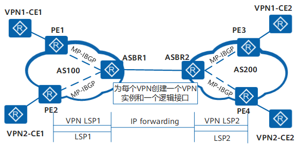
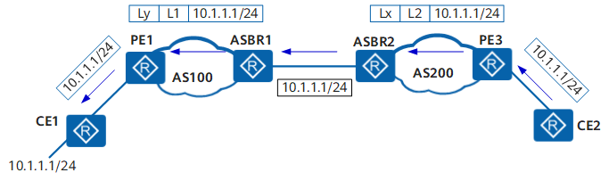
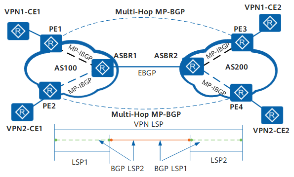
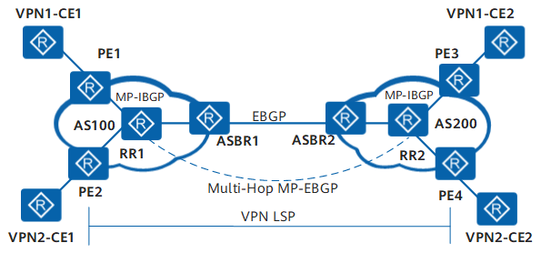
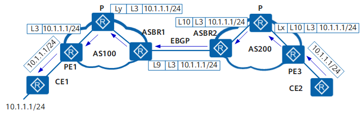

## HCIE笔试 ##

## IPv6报文格式 ##

IPv6报文由IPv6基本报头、IPv6扩展报头以及上层协议数据单元三部分组成。

上层协议数据单元一般由上层协议报头和它的有效载荷构成，有效载荷可以是一个ICMPv6报文、一个TCP报文或一个UDP报文。

### IPv6基本报头 ###

IPv6基本报头有8个字段，固定大小为40字节，每一个IPv6数据报都必须包含报头。基本报头提供报文转发的基本信息，会被转发路径上面的所有设备解析。

IPv6报文格式中主要字段解释如下：

- Version：版本号，长度为4bit。对于IPv6，该值为6
- Traffic Class：流类别，长度为8bit。等同于IPv4中的TOS（Type Of Service）字段，表示IPv6数据报的类或优先级，主要应用于QoS。
- Flow Label：流标签，长度为20bit。IPv6中的新增字段，用于区分实时流量，不同的流量标签+源地址可以唯一确定一条数据流，中间网络设备可以根据这些信息更加高效率的区分数据流。
- Payload Length：有效载荷长度，长度为16bit。有效荷载是指紧跟IPv6报头的数据报的其他部分（即扩展报头和上层的协议数据单元）。该字段只能表示最大长度为65535字节的有效载荷。如果有效荷载的长度超过这个值，该字段会置0，而有效荷载的长度用逐跳选项扩展报头中的超大有效载荷选项来表示。
- Next Header：下一个报头，长度为8bit。该字段定义紧跟在IPv6报头后面的第一个扩展报头（如果存在）的类型，或者上层协议数据单元中的协议类型。
- Hop Limit：跳数限制，长度为8bit。该字段类似于IPv4中的Time to Live字段，它定义了数据报所能经过的最大跳数。没经过一个设备，该数值减去1，当该字段的值为0时，数据报将被丢弃。
- Source Address：源地址，长度为128bit。表示发送方的地址。
- Destination Address：目的地址，长度为128bit。表示接收方的地址。

IPv6和IPv4相比，去除了IHL（Internet Header Length 报头长度）、identifiers（标识）、Flags（标志）、Fragment Offset（片位移）、Header CheckSum（头部校验和）、Options（选项部分）、Padding域（IPv4报头文是32bit的整数倍，在Option后面填充使用），只增加了流标签域，因为IPv6报文头的处理较IPv4大大简化，提高了处理效率。另外，IPv6为了更好支持各种选项处理，提出了扩展头的概念，新增选项时不必修改现有结构就能做到，理论上可以无线扩展，体现了优异的灵活性。

### IPv6扩展报头 ###

在IPv4中，IPv4报头包含可选字段OPtions，内容涉及security、Timestamp、Record route等，这些Options可以将IPv4报头长度从20字节扩充到60字节。在转发过程中，处理携带这些Options的IPv4报文会占用设备很大的资源，因此实际中也很少使用。

IPv6将这些Options从IPv6基本报头中剥离，放到了扩展报头中，扩展报头被置于IPv6报头和上层协议数据单元之间。一个IPv6报文可以包含0个、1个或多个扩展报头，仅当需要设备或目的节点做某些特殊处理时，才由发送方添加一个或多个扩展报头。与IPv4不用，IPv6扩展头长度任意，不受40字节现直，这样便于日后扩充新增选项，这一特性加上选项的处理方式使得IPv6选项能得以真正的利用。但是为了提高处理选项头和传输层协议的性能，扩展报头总是8字节长度的整数倍。

当使用多个扩展报头时，前面包头的Next Header字段指明下一个扩展包头的类型，这样就形成了链状的报头列表。IPv6基本报头中的Next Header字段指明了第一个扩展报头的类型，而第一个扩展报头中的Next Header字段指明了下一个扩展报头的类型（如果不存在，则指明上层协议的类型）。

IPv6扩展报头中主要字段解释如下：

- Next Header：下一个报头，长度为8bit。与基本包头的Next Header的作用相同。指明下一个扩展报头（如果存在）或上层协议类型。
- Extension Header Len：报头扩展长度，长度为8bit。表示扩展报头的长度（不包含Next Header字段）。
- Extension Head Data：扩展报头数据，长度可变。扩展报头的内容，为一系列选项字段和填充字段的组合。

目前，RFC中定义了6个IPv6扩展头：逐跳选项报头、目的选项报头、路由报头、分段报头、认证报头、封装安全净载报头。
<table>
<thead>
<tr>
  <th>报头类型</th>
  <th>代表该类报头的Next Header字段值</th>
  <th>描述</th>
</tr>
</thead>
<tbody>
<tr>
  <td>逐跳选项报头</td>
  <td>0</td>
  <td>该选项主要用于为在传送路径上的每跳转发指定发送参数，传送路径上的每台中间节点都要读取并处理该字段。逐跳选项报头目前的主要应用有以下三种： ·用于巨型载荷（载荷长度超过65535字节）。 ·用于设备提示，使设备检查该选项的信息，而不是简单的转发出去。 ·用于资源预留（RSVP）</td>
</tr>
<tr>
  <td>目的选项报头</td>
  <td>60</td>
  <td>目的选项报头携带了一些只对目的节点才会处理的信息。目前，目的选项报头主要应用于移动IPv6。</td>
</tr>
<tr>
  <td>路由报头</td>
  <td>43</td>
  <td>路由报头和IPv4的Loose Source and Record Route选项类似，该报头能够被IPv6源节点用来强制数据报经过特定的设备。</td>
</tr>
<tr>
  <td>分段报头</td>
  <td>44</td>
  <td>同IPv4一样，IPv6报文发送也收到MTU的限制。当报文长度超过MTU时就需要将报文分段发送，而在IPv6中，分段发送使用的是分段报头。</td>
</tr>
<tr>
  <td>认证报头</td>
  <td>51</td>
  <td>该报头由IPSec使用，提供认证、数据完整性以及重放保护。它还对IPv6基本报头中的一些字段进行保护。</td>
</tr>
<tr>
  <td>封装安全净载报头</td>
  <td>50</td>
  <td>该报头由IPSec使用，提供认证、数据完整性以及重放保护和IPv6数据报的保密，类似于认证报头。</td>
</tr>
</tbody>
</table>

**IPv6扩展报头规约**

当超过一种扩展报头被用在同一个分组里时，报头必须按照下列顺序出现：

- IPv6基本报头
- 逐跳选项报头
- 目的选项报头
- 路由扩展报头
- 分段扩展报头
- 认证扩展报头
- 封装安全有效载荷扩展报头
- 目的选项扩展报头
- 上层协议数据报文

路由设备转发时根据基本报头中Next Header值来决定是否要处理扩展头，并不是所有的扩展报头都需要被转发路由设备查看和处理的。

除了目的选项扩展报头可能出现一次或两次（一次在路由扩展报头之前，另一次在上层协议数据报文之前），其余扩展报头只能出现一次。

## 大二层网络 ##

为了实现业务的灵活变更，虚拟机动态迁移已经成为了一个常态性的业务。虚拟机动态迁移是指在保证虚拟机正常运行的同时，将虚拟机从一个物理服务器移动到另一个物理服务器的过程，该过程对于最终用户来说是无感知的，使得管理员在不影响用户正常使用的的情况下灵活调配服务器资源或者对物理服务器进行维修和升级。虚拟机动态迁移的关键是要保证在迁移时，虚拟机上的业务不会中断，这就要求虚拟机的IP地址、MAC地址等参数保持不变，所以虚拟机的迁移只能在一个二层域内进行，而不能扩二层域迁移。

传统网络中的虚拟机迁移

传统数据中心网络架构中二层网络部分为了提高可靠性，采用冗余设备和冗余链路，在虚拟机迁移过程中会不可避免地产生物理环路。

为了避免物理环路过程中产生的网络风暴，需要采用STP等破坏协议进行破坏，阻塞冗余链路。

由于STP性能的限制，采用STP协议进行破坏的二层网络通常不超过50个网路节点，导致虚拟机动态迁移只能在一个较小的局部范围内进行，应用受到极大限制。

为了实现虚拟机的大范围甚至跨地域的动态迁移，就要求将虚拟机动态迁移可能涉及的服务器都纳入同一个二层网络，形成一个更大范围的二层网络，这样才能实现虚拟机的大范围无障碍的迁移，这种二层网络称为大二层网络。

常见的大二层网络技术有：

- 网络设备虚拟化技术（NVGRE[Network Virtualization using Generic Routing Encapsulation]）。
- TRILL技术。
- VXLAN技术（Virtual eXtensible Local Area Network）。
- EVN技术。

然而，通过网络设备虚拟化技术、TRILL、EVN技术构建物理上的大二层网络，可以将虚拟机迁移的范围扩大。但是，构建物理上的大二层，难免需要对原来的网络做较大的改动，并且大二层网络的范围依然会受到种种条件的限制，然而VXLAN技术能够很好的解决上述问题。

在大二层网络中虚拟机动态歉意可以实现大范围无障碍的迁移。

大二层网络中的虚拟机迁移

### 网络虚拟化技术 ###

NVGRE和XLAN

[两种Overlay技术：NVGRE和XVLAN](https://zhuanlan.zhihu.com/p/144455307)

## ISIS ##

## OSPF ##

### OSPF NSSA ###

**定义**

OSPF规定STUB取余是不能引入外部路由的，这样可以避免大量外部路由对STUB区域路由器带宽和存储资源的消耗。对于既需要引入外部路由又要避免外部路由带来的资源消耗的场景，STUB区域就不再满足需求了。因此产生了NSSA取余。

OSPF NSSA区域（Not-So-Stubby Area）是OSPF新增的一类特殊的区域类型。

NSSA取余和STUB取余有许多相似的地方。两者的差别在于，NSSA区域能够将自治区域外部路由引入并传播到整个OSPF自治域中，同时又不会学习来自OSPF网络其他区域的外部路由。

**N-bit**

一个区域内所有路由器上配置的区域类型必须保持一致。OSPF在Hello报文中使用N-bit来标识路由器支持的区域类型，区域类型选择不一致的路由器不能建立OSPF邻居关系。

虽然协议有要求，但有些厂商实现时违背了，在OSPF DD报文中也置位了N-bit，为了和这些厂商互通，路由器的实现方式是可以通过命令设置N-bit来兼容。

**Type7 LSA**

- Type7 LSA是为了支持NSSA区域而新增的一种LSA类型，用于描述引入的外部路由信息。
- Type7 LSA由NSSA区域的自治域边界路由器（ASBR）产生，其扩散范围仅限于ASBR所在的NSSA区域。
- NSSA区域的区域边界路由器（ABR）受到Type7 LSA时，会有选择地将其转化为Type5 LSA，以便将外部路由信息通告到OSPF网络的其他区域。

**Type7 LSA转化为Type5 LSA**

为了将NSSA区域引入的外部路由发布到其他区域，需要把Type7 LSA转化为Type5 LSA以便在整个OSPF网络中通告。

- P-bit（Propagate bit）用于告知转化路由器该条Type7 LSA是否需要转化。
- 缺省情况下，转换路由器的是NSSA区域中Router ID最大的区域边界路由器（ABR）。
- 只有P-bit置位并且FA（Forwarding Address）不为0的Type7 LSA才能转化为Type5 LSA。FA用来表示发送某个目的地址的报文将被转发到FA所指定的地址。
- 区域边界路由器产生的Type7 LSA缺省路由不会置位P-bit。

**缺省路由环路预防**

在NSSA区域中，可能同时存在多个ABR，为了防止环路产生，边界路由器直接不计算对方发布的缺省路由。

## VXLAN ##

## TRILL ##

## NVGRE ##

## MPLS ##

### 跨域VPN ###

随着MPLS VPN解决方案的广泛应用，服务的终端用户的规格和范围也在增长，在一个企业内部的站点数目越来越大，某个地理位置与另外一个服务提供商相连的需求变得非常的普遍，例如国内运营商的不同城域网之间，或相互协作的运营商的骨干网直接都存在着跨越不同自治域的情况。

一般的MPLS VPN体系结构都是在一个自制系统AS（Autonomous System）内运行，任何VPN的路由信息都是只能在一个AS内按需扩散，没有提供AS内的VPN信息向其他AS扩散的功能。因此，为了支持运营商之间的VPN路由信息交换，就需要扩展现有的协议和修改MPLS VPN体系框架，提供一个不同于基本的MPLS VPN体系结构所提供的互连模型——跨域（Inter-AS）的MPLS VPN，以便可以穿过运营商间的链路来发布路由前缀和标签信息。

RFC中提出了三种跨域VPN解决方案，分别是：

- 跨域VPN-OptionA（Inter-Provider Backbones Option A）方式：需要跨域的VPN在ASBR（AS Boundary Router）间通过专用的接口管理自己的VPN路由，也成为VRF-to-VRF；
- 跨域VPN-OptionB（Inter-Provider Backbones Option B）方式：ASBR间通过MP-EBGP发布标签VPN-IPv4路由，也成为EBGP redistribution of labeled VPN-IPv4 routes；
- 跨域VPN-OptionC（Inter-Provider Backbones Option C）方式：PE间通过Multi-hop MP-EBGP发布标签VPN-IPv4路由，也称为Multihop EBGP redistribution of labeled VPN-IPv4 routes。

**跨域VPN-OptionA方式**

- 跨域VPN-OptionA概述

跨域VPN-OptionA是基本BGP/MPLS IP VPN在跨域环境下的应用，ASBR之间不需要运行MPLS，也不需要为跨域进行特殊配置。这种方式下，两个AS的边界ASBR直接相连，ASBR同时也是各自所在自治系统的PE。两个ASBR都把对端ASBR看做自己的CE设备，将会为每一个VPN创建一个VPN实例，使用EBGP方式向对端发布IPv4路由。

在[图1](http://localhost:7890/pages/DZG1127X/13/DZG1127X/13/resources/dc/images/fig_dc_fd_l3vpn_000701ar.png)中，对于AS100的ASBR1来说，AS200的ASBR2只是它的一台CE设备；同样，对于ASBR2，ASBR1也只是一台接入的CE设备。图中，VPNLSP（Label Switched Path）表示私网隧道，LSP表示公网隧道。

图1 跨域OptionA的组网图

- 跨域VPN-OptionA的路由发布

在PE和ASBR之间运行MP-IBGP协议交换VPN-IPv4路由信息。两个ASBR之间可以运行普通的PE-CE路由协议（BGP或IGP多实例）或静态路由来交互VPN信息；但这是不同AS之间的交互，建议使用EBGP。

例如CE1将目的地址为10.1.1.1/24的路由发布给CE2，其流程[如图2](http://localhost:7890/pages/DZG1127X/13/DZG1127X/13/resources/dc/images/fig_dc_fd_l3vpn_000702ar.png)所示。其中，D表示目的地址，NH表示下一跳，L1和L2表示所携带的私网标签。图中省略公网IGP路由和标签的分配。

图2 跨域VPN-OptionA的路由信息发布

- 跨域VPN-OptionA的报文转发

以LSP为公网隧道的报文转发流程如[图3](http://localhost:7890/pages/DZG1127X/13/DZG1127X/13/resources/dc/images/fig_dc_fd_l3vpn_000703ar.png)所示。其中，L1和L2表示私网标签，Lx和Ly表示公网外层隧道标签。

图3 跨域VPN-OptionA的报文转发

- 跨域VPN-OptionA的特点
  
    - 优点是配置简单：由于ASBR之间不需要运行MPLS，也不需要为跨域进行特殊配置。
    - 缺点是可扩展性差：由于ASBR需要管理所有VPN路由，为每个VPN创建VPN实例。这将导致ASBR上的VPN-IPv4路由数量过大。并且，由于ASBR间是普通的IP转发，要求为每个跨域的VPN使用不同的接口，从而提高了对PE设备的要求。如果跨越多个自治域，中间域必须支持VPN业务，不仅配置量大，而且对中间域影响大。在需要跨域的VPN数量比较少的情况，可以优先考虑使用。

**跨域VPN-OptionB方式**

- 跨域VPN-OptionB概述

如[图4](http://localhost:7890/pages/DZG1127X/13/DZG1127X/13/resources/dc/images/fig_dc_fd_l3vpn_000704ar.png)所示，跨域VPN-OptionB中，两个ASBR通过MP-EBGP交换它们各自从AS的PE设备接收的标签VPN-IPv4路由。图中，VPN LSP表示私网隧道，LSP表示公网隧道。

图4 跨域VPN-OptionB的组网图

跨域VPN-OptionB方案中，ASBR接收本域内和域外传过来的所有跨域VPN-IPv4路由，再把VPN-IPv路由发布出去。但MPLS VPN的基本实现中，PE上只保存与本地VPN实例的VPN Target相匹配的VPN路由。通过对标签VPN-IPv4路由进行特殊处理，让ASBR不进行VPN Target匹配把收到的VPN路由全部保存下来，而不管本地是否有和它匹配的VPN实例。

这种方案的优点是所有的流量都经过ASBR转发，使流量具有良好的可控性，但ASBR的负担重。可以同时使用BGP的路由策略（如对RT的过滤），使ASBR上只保存部分VPN-IPv4路由。

- 跨域VPN-OptionB的路由发布

以[图5](http://localhost:7890/pages/DZG1127X/13/DZG1127X/13/resources/dc/images/fig_dc_fd_l3vpn_000705ar.png)为例说明路由发布过程。本例中，CE1将10.1.1.1/24的路由发布给CE2。NH表示下一跳，L1、L2和L3表示所携带的私网标签。图中省略了公网IGP路由和标签的分配。

图5 跨域VPN-OptionB的路由信息发布

具体过程如下：

1.CE1通过BGP、OSPF或RIP方式将路由发布给AS100内的PE1.

2.AS100内的PE1先通过MP-IBGP方式把标签VPNv4路由发布给AS100的ASBR1，或发布给路由反射器RR（Router REflector），由RR反射给ASBR1。

3.ASBR1通过MP-EBGP方式把标签VPNv4路由发布给ASBR2。由于MP-EBGP在传递路由时，需要改变路由的下一跳，ASBR1向外发布时给这些VPNv4路由信息分配新标签。

4.ASBR2通过MP-IBGP方式把标签VPNv4路由发布给AS200内的PE3，或发布给RR，由RR反射给PE3.当ASBR2向域内的MP-IBGP对等体发布路由时，将下一跳改为自己。

5.AS200内的PE3通过BGP、OSPF或RIP方式将路由发布给CE2。

在ASBR1和ASBR2上都对VPNv4路由交换内层标签，域间的标签由BGP携带，因此ASBR之间不需要运行LDP（Label Distribution Protocol）或RSVP（Resource Reservation Protocol）等协议。

- 跨域VPN-OptionB的报文转发

在跨域VPN-OptionB方式的报文转发中，在两个ASBR上都要对VPN的LSP做一次交换。以LSP为公网隧道的报文转发流程如[图6](http://localhost:7890/pages/DZG1127X/13/DZG1127X/13/resources/dc/images/fig_dc_fd_l3vpn_000706ar.png)所示。其中，L1、L2和L3表示私网标签。Lx和Ly表示公网外层隧道标签。

图6 跨域VPN-OptionB的报文转发

- 跨域VPN-OptionB的特点

	- 不同于OptionA，OptionB方案不受ASBR之间互连链路数目的限制。
	- 局限性：VPN的路由信息是通过AS之间的ASBR来保存和扩散的，当VPN路由较多时，ASBR负担重，容易造成故障点。因此在MP-EBGP方案中，需要维护VPN路由信息的ASBR一般不再负责公网IP转发。

**跨域VPN-OptionC**

- 跨域VPN-OptionC概述

前面介绍的两种方式都能够满足跨域VPN的组网需求，但两种方式也都需要ASBR参与VPN-IPv4路由的维护和发布。当每个AS都有大量的VPN路由需要交换时，ASBR就很可能阻碍网络进一步的扩展。

解决上述问题的方案是：ASBR不维护或发布VPN-IPv4路由，PE之间直接交换VPN-IPv4路由

	- ASBR通过MP-IBGP向各自AS内的PE设备发布标签IPv4路由，并将到达本AS内PE的标签IPv4路由通告给它在对端AS的ASBR对等体，过渡AS中的ASBR也通告带标签的IPv4路由。这样，在入口PE和出口PE之间建立一条LSP；
	- 不同AS的PE之间建立Multihop方式的EBGP连接，交换VPN-IPv4路由；
	- ASBR上不保存VPN-IPv4路由，相互之间也不通告VPN-IPv4路由。

[图7](http://localhost:7890/pages/DZG1127X/13/DZG1127X/13/resources/dc/images/fig_dc_fd_l3vpn_000707ar.png)为跨域VPN-OptionC的组网图，其中，VPN LSP表示私网隧道，LSP表示公网隧道。BGP LSP主要作用是两个PE之间相互交换Loopback信息，由两部分组成，例如图中从PE1到PE3方向建立BGP LSP1，PE3到PE1方向建立BGP LSP2。

图7 跨域VPN-OptionC方式组网图

为提高可扩展性，可以再每个AS中指定一个路由反射器RR，由RR保存所有VPN-IPv4路由，与本AS内的PE交换VPN-IPv4路由信息。两个AS的RR之间建立MP-EBGP连接，通告VPN-IPv4路由。

图8 采用RR的跨域VPN OptionC方式组网图

- 跨域VPN-OptionC的路由发布

跨域VPN-OptionC关键实现是公网跨域隧道的建立。例如在CE1中有一条10.1.1.1/24的路由信息，其发布流程如[图9](http://localhost:7890/pages/DZG1127X/13/DZG1127X/13/resources/dc/images/fig_dc_fd_l3vpn_000709ar.png)所示。D表示目的地址，NH表示下一跳，L3表示所携带的私网标签，L9、L10表示BGP LSP的标签。图中省略了公网IGP路由和标签的分配。

图9 跨域VPN-OptionC的路由发布

- 跨域VPN-OptionC的报文转发

以LSP为公网隧道的报文转发流程如[图10](http://localhost:7890/pages/DZG1127X/13/DZG1127X/13/resources/dc/images/fig_dc_fd_l3vpn_000710ar.png)所示。其中，L3表示私网标签，L10和L9表示BGP LSP的标签，Lx和Ly表示域内公网外层隧道标签。

图10 跨域VPN-OptionC的报文转发

报文从PE3向PE1转发时，需要在PE3上打上三层标签，分别为VPN路由的标签、BGP LSP的标签和公网LSP的标签。到ASBR2时，只剩两层标签，分别是VPN的路由标签和BGP LSP标签；进入ASBR1后，BGP LSP终结，之后就是普通的MPLS VPN的转发流程。

- 跨域VPN-OptionC的特点

	- VPN路由在入口PE和出口PE之间直接交换，不需要中间设备的保存和转发。
	- VPN的路由信息只出现在PE设备上，而P和ASBR只负责报文的转发，似的中间域的设备可以不支持MPLS VPN业务，只需支持MPLS转发，ASBR设备不再成为性能瓶颈。因此跨域VPN-OptionC更适合在跨越多个AS时使用。
	- 更适合支持MPLS VPN的负载分担。
	- 缺点是维护一条端到端的PE连接管理代价较大。

在华为MPLS网络中，IP前缀、二层链路等参数被用来定义一个转发等价类。

## IGMP ##

## ISATAP ##

## Dual Stack ##

## SNMP ##

### SNMP简介 ###
介绍SNMP的定义、目的、版本演进以及受益

**定义**

简单网络管理协议SNMP（Simple Network Management Protocol）是广泛应用于TCP/IP网络的网络管理标准协议。SNMP提供了一种通过运行网络管理软件的中心计算机（即网络管理工作站）来管理设备的方法。

SNMP的特点如下：

- 简单：SNMP采用轮询机制，提供最基本的功能集，适合小型、快速、低价格的环境使用，而且SNMP以UDP报文为承载，因而受到绝大多数设备的支持。
- 强大：SNMP的目标是保证管理信息在任意两点传送，以便于管理员在网络上的任何节点检索信息，进行故障排查。

**目的**

随着网络技术的额飞速发展，在网络不断普及的同时也给网络管理带来了一些问题：

- 网络设备数量成几何级数增长，使得网络管理员对设备的管理变得越来越困难；同时，网络作为一个复杂的分布式系统，其覆盖地域不断扩大，也似的对这些设备进行实时监控和故障排查变得极为困难。
- 网络设备种类多种多样，不同设备厂商提供的管理接口（如命令接口）各不相同，这使得网络管理变得愈发复杂。

在这种背景下，SNMP应运而生。通过“利用网络管理网络”的方式，SNMP实现了对网络设备的高效和批量的管理；同时，SNMP协议也屏蔽了不同产品之间的差异，实现了不同种类和厂商的网络设备之间的统一管理。

### 配置SNMPv3的基本功能 ###

**注意事项**

在配置安全级别时，要确保告警主机的安全级别高于用户的安全级别， 且用户的安全级别高于用户组的安全级别。

安全级别按照安全性从高到低为：

- privacy：鉴权且加密
- authentication：只鉴权
- Node：不鉴权不加密

即如果用户组是privacy级别，用户和告警主机就必须是privacy级别；用户组是authentication级别，用户和告警主机可以使privacy或者authentication级别。

