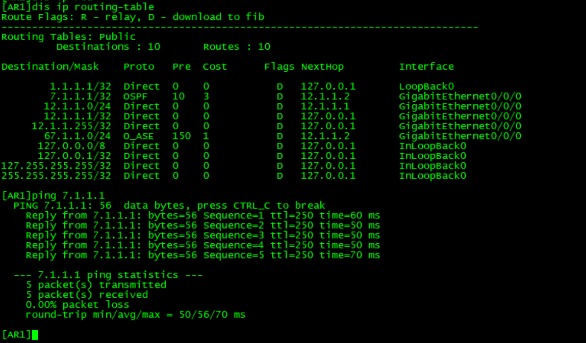
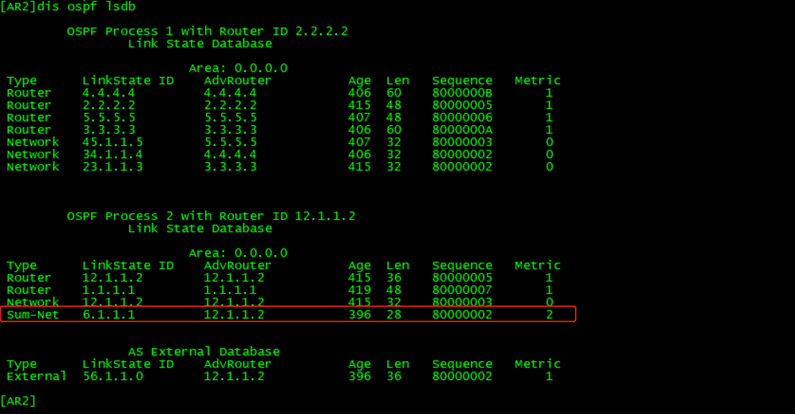

## MPLS ##

**LSP介绍**

IP报文在MPLS网络中经过的路径称为标签交换路径LSP（Label Switched Path），这条路径是在报文转发之前就已经通过各种协议确定并建立的，报文会在特定的LSP上传递。

LSP是一个单向路径，与数据流的方向一致。LSP的入口LER称为入节点（Ingress）；位于LSP中间的额LSR节点称为中间节点（Transit）；LSP的出口LER称为出节点（Egress）。一条LSP可以用0个、1个或多个中间节点，但有且仅有一个入节点和一个出节点。

**MPLS架构：控制平面**

**MPLS架构：数据平面**

**MPLS封装格式**

### MPLS VPN ###

1、CE间路由重叠问题：VRF

2、PE内区分不同VRF路由：RD

	RD值（Route Distinguisher）：在控制层面区分路由（64bit的RD值 + 32bit的IPv4地址 = 96bit的VPNv4地址）。

	RD值与VPN路由一起被携带在BGP Update报文中发送给对端；

	RD值不具有选路能力，不影响路由的发送与接收。

3、控制VPN路由的导入导出：RT

	RT值（Route Target）：用来控制VPN路由的导入导出，增加VPN路由导入导出时的灵活性。
	
	当从VRF表中导出VPN路由时，要用Export RT值对VPN路由进行标记；
	
	当往VRF表中导入VPN路由时，只有所带RT值与VRF表中任意一个Import RT值相符的路由才会被导入到VRF表中。
	
-----

	通告路由时为什么还要携带RD？
		
	因为RT是一种扩展团体属性。而BGP的Route withdraw报文只携带NLRI，不携带任何路由属性，所以回收路由的报文中没有RT。如果一个PE上多个虚拟专用网络都使用了相同的地址，那么它将无法知道withdraw报文回收的是哪条虚拟专用网络路由。所以需要使用RD+IPv4地址唯一标识一条虚拟专用网络路由。虚拟专用网络中RD+IPv4地址组成虚拟专用网络地址，放置在NLRI中。通过RD+IPv4地址来确认回收的是哪条路由。

	使用route-target来代替RD的功能？

	答案仍然是否定的，为了实现灵活的组网和路由控制，route-target是一组import route-target和export route-target，根据业务需要，可以灵活变化和增删它们。就体量和稳定性来考虑，显然不适合作为标识符。

<table>
<thead>
<tr>
  <th></th>
  <th>外层</th>
  <th>内层</th>
</tr>
</thead>
<tbody>
<tr>
  <td>作用</td>
  <td>指示LSR如何将标签报文从始发的源PE通过LSP标签交换到达目的PE</td>
  <td>数据到达对端PE后，PE根据内层label发送给对应的CE</td>
</tr>
<tr>
  <td>由谁分配</td>
  <td>源PE与目的PE间沿途设备</td>
  <td>本地PE打上的标签是对端PE分配</td>
</tr>
<tr>
  <td>协议</td>
  <td>LDP协议</td>
  <td>MP-BGP协议</td>
</tr>
<tr>
  <td>为谁分配</td>
  <td>为PE的loopback口</td>
  <td>每一条VPNV4路由（一个VPN实例下的所有路由可以共享一个）</td>
</tr>
</tbody>
</table>

MPLS VPN 实验

- 核心网建立IGP
	
		ospf 1 router-id 3.3.3.3 
 			area 0.0.0.0 
			  network 3.1.1.1 0.0.0.0 
			  network 23.1.1.0 0.0.0.255 
			  network 34.1.1.0 0.0.0.255

- 核心网建立ldp

		mpls lsr-id 3.1.1.1
		mpls
		#
		mpls ldp
		#
		interface GigabitEthernet0/0/1
		 ip address 23.1.1.3 255.255.255.0 
		 mpls
		 mpls ldp

- MP-BGP

		bgp 100
		 undo default ipv4-unicast
		 peer 6.1.1.1 as-number 100 
		 peer 6.1.1.1 connect-interface LoopBack0
		 # 
		 ipv4-family vpnv4
		  peer 6.1.1.1 enable
		#

- 配置VRF

		#
		ip vpn-instance test
		 ipv4-family
		  route-distinguisher 100:1
		  vpn-target 100:17 export-extcommunity
		  vpn-target 100:17 import-extcommunity
		#
		#
		interface GigabitEthernet0/0/0
		 ip binding vpn-instance test
		 ip address 12.1.1.2 255.255.255.0 
		#

- PE上双向路由引入

		#
		bgp 100
		 #
		 ipv4-family vpn-instance test
		  import-route ospf 2
		#
		
		ospf vpn-instance test 2
			area 0.0.0.0
				import-route bgp

### MPLS VPN 理解 ####

**按照路由控制层面的传递过程**

- CE上

- PE上学到的路由(VRF学到）

- PE把VRF的路由引入到BGP的IPv4 vpn-instance test,

	PE内RD标签、出标签、RT标签
	
	对应接收后，去掉RD标签，RT值对比配置接收RT值

	对比RT决定是否接收

	充分布至VRF的OSPF内

	CE通过OSPF学到

**数据层面**

- CE上查找fib表，转发给R2

- 到达R2 VRF，查询VRF的fib表，tunnelID由下一跳递归而来

- TunnelID与下一跳token一致

- 外层出标签（负责穿越core网）

- 内层标签（负责PE发送到对端CE）

- AR3查询lfib表进行转发

- AR4查询lfib表进行转发，次末跳弹出外层标签

- AR5收到外层弹出后的数据，然后根据内层标签查找lfib进行转发

- 转发至VRF前弹出内层标签

- VRF根据fib表进行转发，到达AR6

- 抓包验证 AR2 --> AR3 (内层1028，外层1026)

- 抓包验证 AR4 --> AR5（外层标签弹出）

### 跨域VPN ###

随着MPLS VPN解决方案的广泛应用，服务的终端用户的规格和范围也在增长，在一个企业内部的站点数目越来越大，某个地理位置与另外一个服务提供商相连的需求变得非常的普遍，例如国内运营商的不同城域网之间，或相互协作的运营商的骨干网直接都存在着跨越不同自治域的情况。

一般的MPLS VPN体系结构都是在一个自制系统AS（Autonomous System）内运行，任何VPN的路由信息都是只能在一个AS内按需扩散，没有提供AS内的VPN信息向其他AS扩散的功能。因此，为了支持运营商之间的VPN路由信息交换，就需要扩展现有的协议和修改MPLS VPN体系框架，提供一个不同于基本的MPLS VPN体系结构所提供的互连模型——跨域（Inter-AS）的MPLS VPN，以便可以穿过运营商间的链路来发布路由前缀和标签信息。

RFC中提出了三种跨域VPN解决方案，分别是：

- 跨域VPN-OptionA（Inter-Provider Backbones Option A）方式：需要跨域的VPN在ASBR（AS Boundary Router）间通过专用的接口管理自己的VPN路由，也成为VRF-to-VRF；
- 跨域VPN-OptionB（Inter-Provider Backbones Option B）方式：ASBR间通过MP-EBGP发布标签VPN-IPv4路由，也成为EBGP redistribution of labeled VPN-IPv4 routes；
- 跨域VPN-OptionC（Inter-Provider Backbones Option C）方式：PE间通过Multi-hop MP-EBGP发布标签VPN-IPv4路由，也称为Multihop EBGP redistribution of labeled VPN-IPv4 routes。

**跨域VPN-OptionA方式**

- 跨域VPN-OptionA概述

	跨域VPN-OptionA是基本BGP/MPLS IP VPN在跨域环境下的应用，ASBR之间不需要运行MPLS，也不需要为跨域进行特殊配置。这种方式下，两个AS的边界ASBR直接相连，ASBR同时也是各自所在自治系统的PE。两个ASBR都把对端ASBR看做自己的CE设备，将会为每一个VPN创建一个VPN实例，使用EBGP方式向对端发布IPv4路由。

	在[图1](http://localhost:7890/pages/DZG1127X/13/DZG1127X/13/resources/dc/images/fig_dc_fd_l3vpn_000701ar.png)中，对于AS100的ASBR1来说，AS200的ASBR2只是它的一台CE设备；同样，对于ASBR2，ASBR1也只是一台接入的CE设备。图中，VPNLSP（Label Switched Path）表示私网隧道，LSP表示公网隧道。

	图1 跨域OptionA的组网图
	

- 跨域VPN-OptionA的路由发布

	在PE和ASBR之间运行MP-IBGP协议交换VPN-IPv4路由信息。两个ASBR之间可以运行普通的PE-CE路由协议（BGP或IGP多实例）或静态路由来交互VPN信息；但这是不同AS之间的交互，建议使用EBGP。

	例如CE1将目的地址为10.1.1.1/24的路由发布给CE2，其流程[如图2](http://localhost:7890/pages/DZG1127X/13/DZG1127X/13/resources/dc/images/fig_dc_fd_l3vpn_000702ar.png)所示。其中，D表示目的地址，NH表示下一跳，L1和L2表示所携带的私网标签。图中省略公网IGP路由和标签的分配。

	图2 跨域VPN-OptionA的路由信息发布
	

- 跨域VPN-OptionA的报文转发

	以LSP为公网隧道的报文转发流程如[图3](http://localhost:7890/pages/DZG1127X/13/DZG1127X/13/resources/dc/images/fig_dc_fd_l3vpn_000703ar.png)所示。其中，L1和L2表示私网标签，Lx和Ly表示公网外层隧道标签。

	图3 跨域VPN-OptionA的报文转发
	

- 跨域VPN-OptionA的特点
  
    - 优点是配置简单：由于ASBR之间不需要运行MPLS，也不需要为跨域进行特殊配置。
    - 缺点是可扩展性差：由于ASBR需要管理所有VPN路由，为每个VPN创建VPN实例。这将导致ASBR上的VPN-IPv4路由数量过大。并且，由于ASBR间是普通的IP转发，要求为每个跨域的VPN使用不同的接口，从而提高了对PE设备的要求。如果跨越多个自治域，中间域必须支持VPN业务，不仅配置量大，而且对中间域影响大。在需要跨域的VPN数量比较少的情况，可以优先考虑使用。

**跨域VPN-OptionB方式**

- 跨域VPN-OptionB概述

	如[图4](http://localhost:7890/pages/DZG1127X/13/DZG1127X/13/resources/dc/images/fig_dc_fd_l3vpn_000704ar.png)所示，跨域VPN-OptionB中，两个ASBR通过MP-EBGP交换它们各自从AS的PE设备接收的标签VPN-IPv4路由。图中，VPN LSP表示私网隧道，LSP表示公网隧道。

	图4 跨域VPN-OptionB的组网图
	

	跨域VPN-OptionB方案中，ASBR接收本域内和域外传过来的所有跨域VPN-IPv4路由，再把VPN-IPv路由发布出去。但MPLS VPN的基本实现中，PE上只保存与本地VPN实例的VPN Target相匹配的VPN路由。通过对标签VPN-IPv4路由进行特殊处理，让ASBR不进行VPN Target匹配把收到的VPN路由全部保存下来，而不管本地是否有和它匹配的VPN实例。

	这种方案的优点是所有的流量都经过ASBR转发，使流量具有良好的可控性，但ASBR的负担重。可以同时使用BGP的路由策略（如对RT的过滤），使ASBR上只保存部分VPN-IPv4路由。

- 跨域VPN-OptionB的路由发布

	以[图5](http://localhost:7890/pages/DZG1127X/13/DZG1127X/13/resources/dc/images/fig_dc_fd_l3vpn_000705ar.png)为例说明路由发布过程。本例中，CE1将10.1.1.1/24的路由发布给CE2。NH表示下一跳，L1、L2和L3表示所携带的私网标签。图中省略了公网IGP路由和标签的分配。

	图5 跨域VPN-OptionB的路由信息发布
	

	具体过程如下：

	1.CE1通过BGP、OSPF或RIP方式将路由发布给AS100内的PE1.

	2.AS100内的PE1先通过MP-IBGP方式把标签VPNv4路由发布给AS100的ASBR1，或发布给路由反射器RR（Router REflector），由RR反射给ASBR1。

	3.ASBR1通过MP-EBGP方式把标签VPNv4路由发布给ASBR2。由于MP-EBGP在传递路由时，需要改变路由的下一跳，ASBR1向外发布时给这些VPNv4路由信息分配新标签。

	4.ASBR2通过MP-IBGP方式把标签VPNv4路由发布给AS200内的PE3，或发布给RR，由RR反射给PE3.当ASBR2向域内的MP-IBGP对等体发布路由时，将下一跳改为自己。

	5.AS200内的PE3通过BGP、OSPF或RIP方式将路由发布给CE2。

	在ASBR1和ASBR2上都对VPNv4路由交换内层标签，域间的标签由BGP携带，因此ASBR之间不需要运行LDP（Label Distribution Protocol）或RSVP（Resource Reservation Protocol）等协议。

- 跨域VPN-OptionB的报文转发

	在跨域VPN-OptionB方式的报文转发中，在两个ASBR上都要对VPN的LSP做一次交换。以LSP为公网隧道的报文转发流程如[图6](http://localhost:7890/pages/DZG1127X/13/DZG1127X/13/resources/dc/images/fig_dc_fd_l3vpn_000706ar.png)所示。其中，L1、L2和L3表示私网标签。Lx和Ly表示公网外层隧道标签。

	图6 跨域VPN-OptionB的报文转发
	

- 跨域VPN-OptionB的特点

	- 不同于OptionA，OptionB方案不受ASBR之间互连链路数目的限制。
	- 局限性：VPN的路由信息是通过AS之间的ASBR来保存和扩散的，当VPN路由较多时，ASBR负担重，容易造成故障点。因此在MP-EBGP方案中，需要维护VPN路由信息的ASBR一般不再负责公网IP转发。

**跨域VPN-OptionC**

- 跨域VPN-OptionC概述

	前面介绍的两种方式都能够满足跨域VPN的组网需求，但两种方式也都需要ASBR参与VPN-IPv4路由的维护和发布。当每个AS都有大量的VPN路由需要交换时，ASBR就很可能阻碍网络进一步的扩展。

	解决上述问题的方案是：ASBR不维护或发布VPN-IPv4路由，PE之间直接交换VPN-IPv4路由

	- ASBR通过MP-IBGP向各自AS内的PE设备发布标签IPv4路由，并将到达本AS内PE的标签IPv4路由通告给它在对端AS的ASBR对等体，过渡AS中的ASBR也通告带标签的IPv4路由。这样，在入口PE和出口PE之间建立一条LSP；
	- 不同AS的PE之间建立Multihop方式的EBGP连接，交换VPN-IPv4路由；
	- ASBR上不保存VPN-IPv4路由，相互之间也不通告VPN-IPv4路由。

	[图7](http://localhost:7890/pages/DZG1127X/13/DZG1127X/13/resources/dc/images/fig_dc_fd_l3vpn_000707ar.png)为跨域VPN-OptionC的组网图，其中，VPN LSP表示私网隧道，LSP表示公网隧道。BGP LSP主要作用是两个PE之间相互交换Loopback信息，由两部分组成，例如图中从PE1到PE3方向建立BGP LSP1，PE3到PE1方向建立BGP LSP2。

	图7 跨域VPN-OptionC方式组网图
	

	为提高可扩展性，可以再每个AS中指定一个路由反射器RR，由RR保存所有VPN-IPv4路由，与本AS内的PE交换VPN-IPv4路由信息。两个AS的RR之间建立MP-EBGP连接，通告VPN-IPv4路由。

	图8 采用RR的跨域VPN OptionC方式组网图
	

- 跨域VPN-OptionC的路由发布

	跨域VPN-OptionC关键实现是公网跨域隧道的建立。例如在CE1中有一条10.1.1.1/24的路由信息，其发布流程如[图9](http://localhost:7890/pages/DZG1127X/13/DZG1127X/13/resources/dc/images/fig_dc_fd_l3vpn_000709ar.png)所示。D表示目的地址，NH表示下一跳，L3表示所携带的私网标签，L9、L10表示BGP LSP的标签。图中省略了公网IGP路由和标签的分配。

	图9 跨域VPN-OptionC的路由发布
	

- 跨域VPN-OptionC的报文转发

	以LSP为公网隧道的报文转发流程如[图10](http://localhost:7890/pages/DZG1127X/13/DZG1127X/13/resources/dc/images/fig_dc_fd_l3vpn_000710ar.png)所示。其中，L3表示私网标签，L10和L9表示BGP LSP的标签，Lx和Ly表示域内公网外层隧道标签。

	图10 跨域VPN-OptionC的报文转发
	

	报文从PE3向PE1转发时，需要在PE3上打上三层标签，分别为VPN路由的标签、BGP LSP的标签和公网LSP的标签。到ASBR2时，只剩两层标签，分别是VPN的路由标签和BGP LSP标签；进入ASBR1后，BGP LSP终结，之后就是普通的MPLS VPN的转发流程。

- 跨域VPN-OptionC的特点

	- VPN路由在入口PE和出口PE之间直接交换，不需要中间设备的保存和转发。
	- VPN的路由信息只出现在PE设备上，而P和ASBR只负责报文的转发，似的中间域的设备可以不支持MPLS VPN业务，只需支持MPLS转发，ASBR设备不再成为性能瓶颈。因此跨域VPN-OptionC更适合在跨越多个AS时使用。
	- 更适合支持MPLS VPN的负载分担。
	- 缺点是维护一条端到端的PE连接管理代价较大。

在华为MPLS网络中，IP前缀、二层链路等参数被用来定义一个转发等价类。

